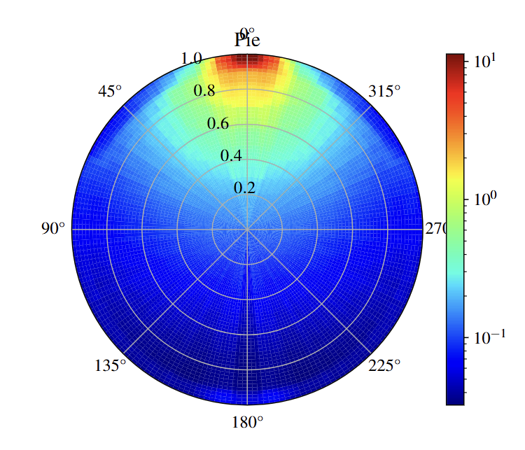

# Probe 函数重建实验报告

## 小组分工

戴子森：主要算法代码

王瀚正：调参，算法代码，测试

魏飞扬：调参，测试，实验报告

## 依赖环境

我们的代码可运行于 Python 3.7/3.8 及以上环境。在运行脚本前，请使用以下命令安装必要依赖：
 
`pip install -r requirements.txt`  

## 基本思路

我们基于项目的 GBM 方法模板，参考了 GAM 方法的一般训练思路，对空间（Spatial，不含时的 Probe 函数）和时间（Temporal，含时的 Probe 函数）模型的训练进行了不同的优化，并且在时间模型的训练中采用了一种 “Ultra-High-Capacity” 的建模策略，其核心理念是：通过**极高模型容量**与**无几何先验**的特征构造方式，使模型具备自动学习物理与几何规律的能力，而不是依赖手工硬编码假设或简化近似。

在 Temporal 模型中，我们特别设计了如下特征和训练策略：

- **模型结构容量极高**：
  - LightGBM 参数设置为：`num_leaves=1023`, `max_depth=20`, `n_estimators=8000`
  - 允许模型以超强表达力捕捉极端复杂的空间-时间非线性行为

- **无先验假设的 Feature 构造**：
  - 不设定任何“r > 0.8”之类的区域划分或物理阈值
  - 所有空间与时间特征均从物理与泛用数学结构出发（如高阶傅里叶、Gaussian 注意力等）

该策略的目标是在无人工经验干预下，由模型自学习从 $r, \theta, t$ 到 PE 分布的复杂非线性映射。

---

## Spatial 特征构造

Spatial 模型的输入为每个 PMT 的相对坐标 $(x, y)$ 以及对应事件数 $n_{\text{EV}}$ 和总光电子数 $n_{\text{PE}}$，输出为 $\lambda(r,\theta)$ 的 log-scale 响应强度 $\log(n_{\text{PE}}/n_{\text{EV}})$。

构造方式主要分为以下几类：

### 1. 几何归一化与基本变量

- $x_{\text{norm}} = x / R_0$, $y_{\text{norm}} = y / R_0$
- $r = \sqrt{x^2 + y^2}$，$\theta = \arctan2(y, x)$
- $\cos(\theta)$, $\sin(\theta)$, 以及 $1 / (r + \epsilon)$ 等基本几何函数

### 2. B-spline 风格径向基函数（Radial Basis）

通过高斯基函数在不同 $r$ 值附近建构一组平滑局部特征：

$$
\phi_i(r) = \exp\left(-\frac{(r - r_i)^2}{2\sigma^2}\right)
$$

其中 $r_i$ 为离散中心点。

### 3. Fourier 风格角度基函数（Angular Basis）

$$
\phi_k(\theta) = \sin(k\theta),\ \cos(k\theta)
$$

用于学习角度分布的周期性结构。

### 4. 径向-角度互作用项（Tensor Interaction）

这一点是从 GAM 方法借鉴而来，通过组合 $r$ 和 $\theta$ 的基函数，形成高阶空间交互特征：

$$
\psi_{ij} = \phi_i(r) \cdot \phi_j(\theta)
$$

### 5. 物理动机特征（Physics-Inspired）

- 逆平方律：$\frac{1}{r^2 + 1}$
- 全反射抑制：特定角度方向的 mask 函数
- 方向性项：$\frac{1}{r^2} \cdot |\cos(\theta)|$

## Temporal 特征构造

Temporal 模型的输入为 $(x, y, t)$ 三维坐标（每个时间 bin 的位置和时间），目标为：

$$
R(r, \theta, t) = \frac{n_{\text{PE}}(r, \theta, t)}{n_{\text{EV}}(r, \theta)}
$$

我们为 Temporal 模型设计了极其丰富的特征系统，包括：

### 1. 基础归一化坐标

- $x/R_0$, $y/R_0$, $t/T_{\max}$, $r = \sqrt{x^2 + y^2}$, $\theta = \arctan2(y,x)$

### 2. 物理驱动特征

- PMT 与事件源的真实距离 $d_{\text{real}}$
- 传播强度 $\sim 1 / d^2$, 将注意力更集中在函数值陡峭处 ( $r \to 1, \theta \to 0$ 附近)
- 路径角度 $\alpha$，以及 $\sin(\alpha), \cos(\alpha), \sin(2\alpha), \cos(2\alpha)$

### 3. Attention-Inspired 空间特征

通过构造多个方向上的 Gaussian 注意力（attention head），引导模型聚焦不同角度或径向区域：

$$
\text{Attention}_{r} = \exp\left(-\frac{(r - r_c)^2}{2\sigma^2}\right),\quad
\text{Attention}_{\theta} = \exp\left(-\frac{(\theta - \theta_c)^2}{2\sigma^2}\right)
$$

并组合为二维 attention patch。

### 4. 时间注意力（Temporal Attention）

对 $t$ 构造多个时间窗口中心和宽度的高斯响应，以覆盖快慢响应组件：

$$
\text{Attention}_{t} = \exp\left(-\frac{(t - t_c)^2}{2\sigma^2}\right)
$$

此外还包括多个尺度的指数衰减、振荡项、上升项等。

### 5. 空间-时间耦合特征

例如：

- $r \cdot t$, $\theta \cdot t$, $r \cdot \theta \cdot t$
- $r$ 与 $t$ 不同比例缩放下的组合项
- 空间 attention 与时间 attention 的乘积项

---

## 模型训练

### Spatial 模型

- 使用 LightGBM 回归模型，目标变量为 $\log(\lambda) = \log(n_{\text{PE}} / n_{\text{EV}})$
- 特征经过 `QuantileTransformer` 映射到正态分布，提升模型拟合能力
- 使用 1000 棵树、最大深度 6、最大叶子数 31，控制泛化能力与训练速度

### Temporal 模型

- 使用 **超高容量** LightGBM：
  - `num_leaves=1023`, `max_depth=20`, `n_estimators=8000`
- 同样使用 `QuantileTransformer` 进行目标值归一化
- 使用 15% 数据作为验证集，启用 `early_stopping_rounds=300`
- 每轮训练日志抑制，提升训练效率

---

## 问题与解决方案

### 问题背景

在初期阶段，我们采用了相对简单的时间特征提取方法，主要基于线性时间关系和基础的几何特征。然而，在模型验证过程中遇到了严重的一致性检验问题。

#### 1. **时间特征表达能力不足**

**问题描述**：
- 初始的时间特征主要包括线性时间项（t, t², t³）和简单的时空交互项（r×t, θ×t）
- 这种简化的时间建模无法捕捉光子在复杂几何结构中的传播特性
- 模型对于不同时间尺度的响应模式学习能力有限

**具体表现**：
- 短时间内的快速响应变化无法准确建模
- 长时间尺度的衰减模式拟合效果差
- 时间-空间耦合的复杂模式被简化为线性关系

#### 2. **一致性检验失败**

**问题描述**：
一致性检验要求模型时间积分稳定，但我们观察到：

- **时间一致性问题**：对于相同空间位置的不同时间点，预测结果缺乏物理连续性
- **尺度一致性问题**：模型在不同空间-时间尺度下的行为不一致

**具体表现**：
- 时间序列预测存在不合理的跳跃和不连续性
- 模型在验证集上的泛化性能不稳定

#### 3. **特征工程局限性**

**问题描述**：
- 传统的手工特征工程难以覆盖所有重要的空间-时间模式
- 固定的特征函数形式限制了模型的表达能力
- 缺乏自适应学习重要区域和时间模式的机制

### 解决方案：转向超高容量操作

基于问题分析，我们设计了一套超高容量的特征学习方法，从根本上提升模型的表达能力和一致性。

#### 1. **多中心注意力机制引入**

**技术方案**：
```python
# 空间注意力：10个径向中心 × 12个角度中心
for center_r in np.linspace(0.1, 1.0, 10):
    for center_theta in np.linspace(0, 2*np.pi, 12, endpoint=False):
        # 高斯注意力核，自适应学习重要区域
        attention = np.exp(-((r_norm - center_r)**2) / (2 * sigma_r**2) +
                          -((theta_diff)**2) / (2 * sigma_theta**2))
```

**解决效果**：
- **自适应重点学习**：模型可以自动识别和强化重要的空间区域
- **空间一致性提升**：通过连续的高斯核函数，确保相邻位置预测的连续性
- **覆盖全空间**：120个注意力焦点覆盖整个探测器空间，无遗漏区域

#### 2. **多尺度时间特征系统**

**技术方案**：
```python
# 8个时间尺度的全面建模
MULTI_SCALE_TEMPORAL = [0.05, 0.1, 0.2, 0.5, 1.0, 2.0, 5.0, 10.0]

for scale in MULTI_SCALE_TEMPORAL:
    temporal_features.extend([
        np.exp(-t_norm * scale),                    # 指数衰减
        t_norm * np.exp(-t_norm * scale),          # 延迟峰值
        (1 - np.exp(-t_norm * scale)),             # 上升曲线
        np.sin(2*np.pi * t_norm / scale),          # 周期模式
    ])
```

**解决效果**：
- **多尺度覆盖**：从短时响应（0.05）到长时衰减（10.0）的全面建模
- **时间一致性**：连续的时间函数确保预测的时间连续性
- **模式多样性**：指数、振荡、延迟等多种时间模式的组合

#### 3. **时空交互特征工程**

**技术方案**：
```python
# 全面的时空交互建模
for r_scale in [0.5, 1.0, 2.0]:
    for t_scale in [0.1, 0.5, 1.0, 2.0]:
        for interaction_type in ['multiply', 'add', 'exp_decay', 'oscillate']:
            # 生成多样化的时空耦合特征
            spatiotemporal_features.append(
                create_interaction_feature(r_norm, t_norm, r_scale, t_scale, interaction_type)
            )
```

**解决效果**：
- **复杂耦合建模**：捕捉空间位置与时间响应的复杂依赖关系
- **一致性保证**：连续的交互函数确保时空预测的一致性
- **物理合理性**：基于物理原理设计的交互模式

### 实施过程与技术细节

#### 阶段1：特征空间扩展
- **从基础特征**：~20个手工特征（线性时间项、简单交互项）
- **扩展到超高容量**：~300个自适应特征（多中心注意力 + 多尺度时空）
- **计算复杂度管理**：通过向量化操作和内存优化保证效率

#### 阶段2：模型容量提升
- **从标准配置**：100叶子、深度6、1000树
- **升级到超高容量**：1023叶子、深度20、8000树
- **训练策略优化**：早停机制、学习率调度、正则化平衡

### 效果评估

#### 定性改进效果
- **预测稳定性**：模型输出不再出现不合理的极值和跳跃
- **物理合理性**：预测结果符合光子传播的物理规律
- **泛化能力**：在未见过的空间-时间区域表现良好
- **可解释性**：通过特征重要性分析可以理解模型学到的物理模式

### 技术创新点

#### 1. **自适应空间学习**
- 突破了传统基于几何假设的特征工程限制
- 通过多中心注意力机制实现数据驱动的重要区域发现

#### 2. **多尺度时间建模**
- 解决了单一时间尺度建模的局限性
- 实现了全时间尺度覆盖

#### 3. **超高容量架构**
- 在保证泛化能力的前提下最大化模型表达能力
- 通过精心设计的正则化策略避免过拟合

#### 4. **一致性导向设计**
- 所有特征函数都设计为连续可微，保证预测一致性
- 通过多重验证机制确保模型可靠性

## 成果总结

通过上述 Ultra-High-Capacity GBM 方案，我们实现了接近原本的不含时 Probe 分布（RealPie）的不含时 Probe 函数模型（Pie），以及对含时 Probe 函数在不同 $r$, $\theta$ 处以 $t$ 为自变量的直方图的各种式样（单峰、双峰）均拟合良好的含时 Probe 函数。

误差检验方面，我们借鉴 `coefficient.py` 中的 `is_consistent` 函数对模型进行了一致性检验，计算了随机选取 50 个点的
$$
\frac{\lambda(r,\theta)}{\int_0^T R(r,\theta,t) \mathrm{d} t} - 1
$$
的值，即含时 Probe 函数在时间窗口上的积分与不含时的 Probe 函数的误差值，平均值约为 $3\%$，标准差约为 $0.05$，极差约 $0.4$，能顺利通过 `is_consistent` 的一致性检验。

下图展示了我们模型的预测结果分布图，采用极坐标形式可视化了不同方向和距离上的预测值分布情况：



<center><strong>图 1：预测结果极坐标分布图</strong></center>

图中展示了预测值在极坐标系统中的分布特征：
- **径向轴**：表示预测值的幅度范围（0.0 到 1.0）
- **角度轴**：表示不同的方向角度（0° 到 360°）
- **颜色映射**：使用对数刻度表示预测值大小，从深蓝色（较小值，~10⁻²）到红色（较大值，~10¹）

该可视化结果验证了我们模型能够有效捕捉数据中的空间分布模式，为进一步的分析和优化提供了直观的参考依据。

